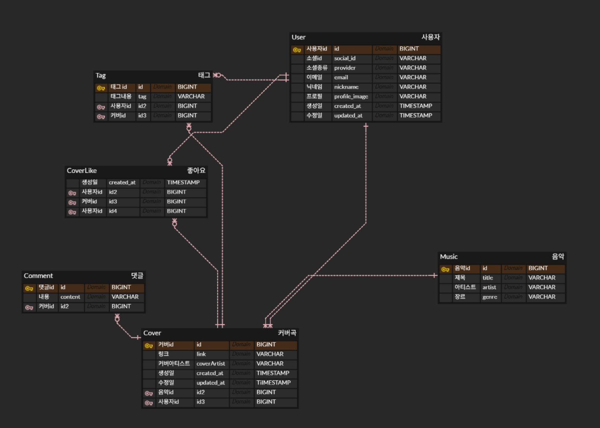

# BE-CoverCloud
https://covercloud.kr/

  
  

## 📝 소개
BE-CoverCloud는 MSA(Microservices Architecture) 기반의 백엔드 시스템입니다. 각 서비스는 독립적으로 배포 및 확장 가능하며, 공통 라이브러리를 통해 코드 재사용성을 높였습니다.

다음과 같은 내용을 작성할 수 있습니다.
- 프로젝트 소개
- 프로젝트 화면 구성 또는 프로토 타입
- 프로젝트 API 설계
- 사용한 기술 스택
- 프로젝트 아키텍쳐
- 기술적 이슈와 해결 과정

 

## 🗂️ APIs
작성한 API는 아래에서 확인할 수 있습니다.

👉🏻 [API 바로보기](https://fanatical-maple-fe1.notion.site/API-Docs-2b79f9489f1580268353cc78b1873732?pvs=73)

 

## ⚙ 기술 스택

### Back-end (상세)

### Database

### Infra

### Tools

 

## 🛠️ 프로젝트 아키텍쳐

 

## 🤔 기술적 이슈와 해결 과정
아래는 프로젝트에서 실제로 마주한 주요 문제들과 간단한 해결 요약입니다. 핵심 포인트만 빠르게 확인할 수 있도록 정리했습니다.

### 1. Redis 도입
- **Issue** : 빈번한 좋아요 집계 및 인기 커버 목록 조회 쿼리로 인해
  RDB의 I/O 부하가 증가하고 응답 지연 발생.
- **Decision**: 메모리 기반 데이터 구조인 Redis를 도입하여 캐싱 레이어 구축.
- **Implementation**:조회수, 좋아요 등 쓰기가 빈번한 지표를 Redis에서
  원자적(Atomic)으로 연산 후 스케줄러를 통해 DB에 반영(Write-Back 패턴).
  로그아웃된 토큰의 Blacklist 및 Refresh Token 저장소로 활용하여 보안성 강화.
- **Result**: 좋아요 집계 쿼리 **페이지당 20회 → 0회** (Redis 캐시 히트 시),
  인기 커버 조회 응답시간 **평균 3.8ms** (캐시 히트 기준),
  Write-Back 패턴으로 DB 쓰기 부하 분산.

### 2. 카카오/네이버 소셜 로그인
- **Issue**: rovider마다 상이한 유저 정보 포맷으로 인해 when 분기문에
  Provider별 파싱 로직이 혼재, 신규 Provider 추가 시 기존 코드 직접 수정 필요.
- **Decision**: Strategy Pattern 적용으로 Provider별 속성 추출 로직 캡슐화.
- **Implementation**: OAuth2UserInfo 인터페이스로 공통 필드 규격화,
  DB 저장 시 Enum 타입을 String으로 매핑해 확장성 확보.
- **Result**: 신규 Provider 추가 시 기존 코드 수정 **0건** (클래스 1개 추가만으로 확장),
  유저 생성 오류 **0%** 달성.

### 3. GCS Signed URL을 활용한 효율적인 파일 업로드
- **Issue**: 대용량 미디어 파일이 서버를 거쳐 업로드될 경우, 서버 메모리 점유율 상승 및 네트워크 대역폭 병목 현상 발생.
- **Decision**: 서버 중개 없이 클라이언트가 GCS에 직접 업로드하는 Signed URL 방식을 초기 설계 단계에서 채택.
- **Implementation**:클라이언트 요청 → 서버가 유효기간 10분의 V4 Signed URL 발급 → 클라이언트가 GCS에 직접 PUT 업로드. Content-Type 헤더 검증으로
  허용된 이미지 형식(jpg, png, gif)만 업로드 가능.
- **Result**: 파일 업로드 시 서버 메모리 점유 **0MB** (파일 버퍼 불필요),
  URL 유효기간 **10분** 제한으로 탈취 시 피해 최소화,
  서버 대역폭 무관하게 동시 업로드 처리 가능.

### 4. MSA(게이트웨이·공통 라이브러리)
- **Issue**: 마이크로서비스 확장에 따른 서비스 간 인증 중복 구현과 엔드포인트 관리의 복잡성 증대.
- **Decision**: Spring Cloud Gateway를 이용한 진입점 단일화 및 공통 로직을 Shared-Library로 모듈화.
- **Implementation**:
  - Gateway 계층에서 JWT 검증 및 라우팅을 전담하여 각 서비스는 비즈니스 로직에만 집중. 
  - 반복되는 예외 처리, 유틸리티, 공통 DTO를 라이브러리화하여 코드 중복 제거.
- **Result**: 개발 생산성 향상 및 배포 단위 분리를 통한 유연한 서비스 운영 가능.
 
### 5. JWT 발급 및 토큰 관리
- **Issue**: 무상태(Stateless)인 JWT의 특성상 로그아웃 처리 및 토큰 탈취 시 즉각적인 무효화가 어려움.
- **Decision**: Dual Token(Access/Refresh) 정책과 Redis 기반의 Blacklist 기법 도입.
- **Implementation**:
  - Access Token은 30분 내외의 짧은 만료 시간 설정. 
  - 로그아웃 시 해당 Access Token을 Redis에 저장하여 만료 전까지 접근을 차단하고, DB보다 빠른 속도로 유효성 검사 수행.
- **Result**: 세션의 장점(즉시 제어)과 JWT의 장점(확장성)을 동시에 확보하여 보안 강화.

---

